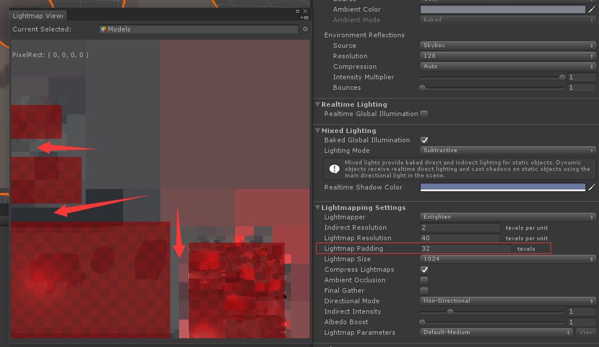
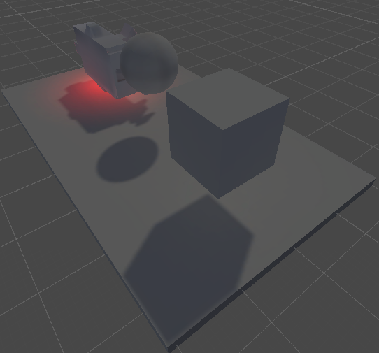
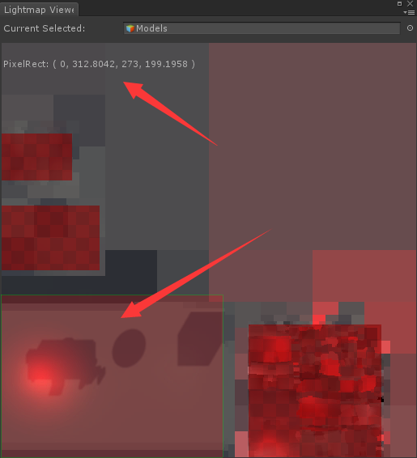
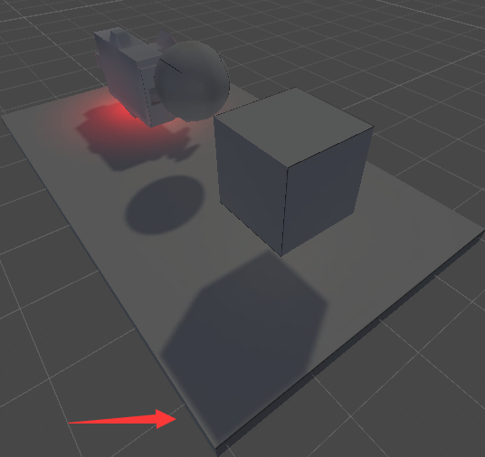
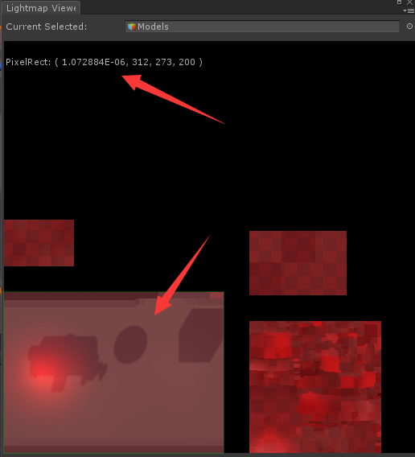
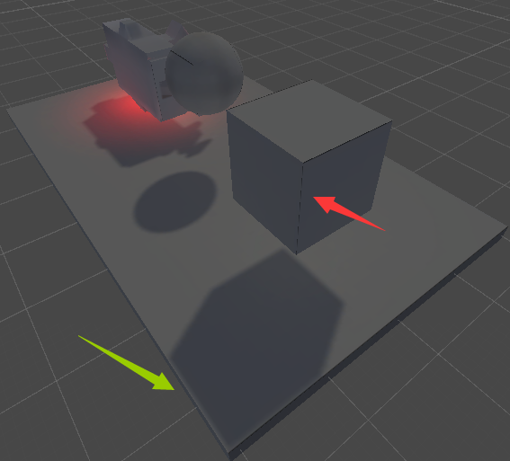
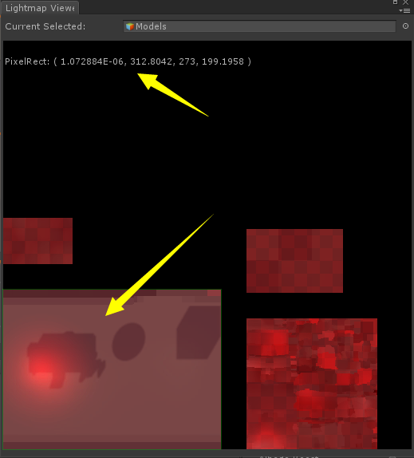
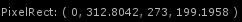
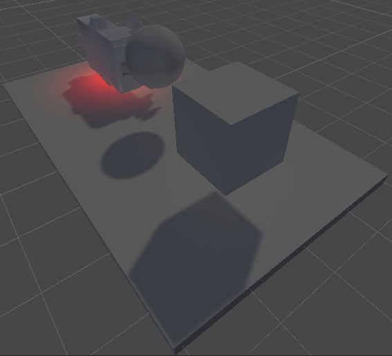
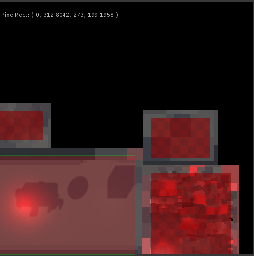

# LightmapRepacker_FixedDemo

An fixed demo of splitting & packing of a lightmap. (Unity 2018)

## Demo演示步骤

1. 打开Scene/test.unity这个测试场景
2. 选中需要执行Lightmap重组的Models节点
3. 执行Tools/LightmapRepacker/Repack For Selected GOs， lightmap重组，此场景的lightmap，和涉及模型都会重新计算uv，并更新回所有的Renderer
4. 如果要再次测试，请**不要保存结果**，直接重新载入一次场景，再次从步骤2开始执行

## 实现步骤说明

1. 遍历所有需要处理的Renderer，记录Renderer.lightmapScaleOffset
2. 读取用于Lightmap采样的那一套纹理，并且做简单计算
   1. 计算LightmapUV的初始包围盒
   2. 计算经过lightmapScaleOffset变换后的包围盒lightmapUVBounds，用于后面的像素提取
        ```CSharp
        // 放缩平移变化
        _uv.x *= lightmapScaleOffset.x;
        _uv.y *= lightmapScaleOffset.y;
        _uv.x += lightmapScaleOffset.z;
        _uv.y += lightmapScaleOffset.w;
        ```
3. 计算像素范围，Lightmap像素提取之前，通过选取正确的浮点取整方式来确保UV涵盖到的像素被正确包含
    ```CSharp
    // 用扩大方式来取整，确保相关像素完美包含
    int pixMinX = ( int )Math.Max( Mathf.Floor( lightmapUVBounds.x * lightmapData.width ), 0 );
    int pixMaxX = ( int )Math.Min( Mathf.Ceil( lightmapUVBounds.z * lightmapData.width ), lightmapData.width );
    int pixMinY = ( int )Math.Max( Mathf.Floor( lightmapUVBounds.y * lightmapData.height ), 0 );
    int pixMaxY = ( int )Math.Min( Mathf.Ceil( lightmapUVBounds.w * lightmapData.height ), lightmapData.height );
    ```
4. 使用stbrp_rect库来重新打包LightmapAtlas

    ```CSharp
    // 使用了非常出色的stb万能库之一：stb_rect来制作Atlas
    // 当然也可用Unity的Texture2D.PackTextures方法，但是要注意防缩问题
    // https://github.com/nothings/stb/blob/master/stb_rect_pack.h
    // simple 2D rectangle packer with decent quality

    // 获取lightmap之间的间隙宽度，用于填充块与块的右上部位
    var Padding = LightmapEditorSettings.padding;
    // 传入自己的TexturePacker之前，把border大小加上去
    var rt = default( NativeAPI.stbrp_rect );
    rt.w = ( ushort )( ( pixMaxX - pixMinX ) + Padding );
    rt.h = ( ushort )( ( pixMaxY - pixMinY ) + Padding );
    ```

    演示一下Lightmap块与块之间空隙（32像素），注意最左下方是无缝的
    

5. 重新构建新LightmapAtlas，并计算新的lightScaleOffset
    ```CSharp
    // 经过pack计算后的输出，在输出贴图上的像素位置位置
    NativeAPI.stbrp_rect rt;
    // ...
    // 原始像素包围盒
    int i_minx = lightmapRect.lightmapPixelBounds.x;
    int i_miny = lightmapRect.lightmapPixelBounds.y;
    int i_maxx = lightmapRect.lightmapPixelBounds.z;
    int i_maxy = lightmapRect.lightmapPixelBounds.w;
    // lightmap像素块copy
    fixed ( Vector4* _atlas_pixels = atlas_pixels.pixels ) {
        for ( int y = i_miny; y < i_maxy; ++y ) {
            int dy = y - i_miny + rt.y;
            // 纹理坐标需要翻转一下，像素是翻转了的
            int _dy = atlasSize - 1 - dy;
            int _sy = lightmapData.height - 1 - y;
            int _dy_stride = _dy * atlasSize;
            int _sy_stride = _sy * lightmapData.width;
            for ( int x = i_minx; x < i_maxx; ++x ) {
                int dx = x - i_minx + rt.x;
                _atlas_pixels[ _dy_stride + dx ] = lightmapData.GetPixel( x, _sy );
            }
        }
    }
    var uvBounds = new Vector4d();
    uvBounds.x = ( rt.x / ( float )atlasSize );
    uvBounds.y = ( rt.y / ( float )atlasSize );
    // 计算在新的lightmap纹理下的纹理坐标包围盒，由于pack之前我们人为加了一个Padding，所以这里计算要减去
    uvBounds.z = ( ( ( rt.x + rt.w ) - Padding ) / ( float )atlasSize );
    uvBounds.w = ( ( ( rt.y + rt.h ) - Padding ) / ( float )atlasSize );
    // 重新计算新的scaleOffset
    renderer.lightmapScaleOffset = CalculateUVScaleOffset( lightmapRect.meshUVBounds, uvBounds );
    ```

6. 完成，来看看结果

    1. 处理之前，场景原样

        

    2. 处理之前，计算出来的像素区域，浮点像素精度

        

    3. 处理之后，场景样貌，注意lightmap出现了明显偏移防缩，而且还出现了黑边

        

    4. 处理之后，计算出来的像素区域出现了浮点误差

        

    结果非常糟糕，重新映射后的lightmap不仅位置出现了明显的平移和防缩，而且还有黑边出现，这是显然无法容忍的，要想办法解决

## 解决问题

1. 消除平移和防缩误差

    这个问题明显出在步骤3，为了去提取lightmap上的涵盖像素，所以从UV计算像素区域时，我们执行了一系列的取整操作，这就丢失了最重要的精度，所以我们要把这部分取整丢失的精度重新补偿回来。

    1. 计算浮点像素精度的区域
        ```CSharp
        float fMinX = lightmapUVBounds.x * lightmapData.width;
        float fMaxX = lightmapUVBounds.z * lightmapData.width;
        float fMinY = lightmapUVBounds.y * lightmapData.height;
        float fMaxY = lightmapUVBounds.w * lightmapData.height;
        // 保存结果
        lightmapRect.lightmapPixelFBounds = new Vector4d( fMinX, fMinY, fMaxX, fMaxY );
        ```

    2. 浮点补偿
        ```CSharp
        // 关键，把取整后丢失的精度，重新补偿回来，这样UV值相对新的像素位置的偏移就前后一致了
        var errorX = lightmapRect.lightmapPixelFBounds.x - lightmapRect.lightmapPixelBounds.x;
        var errorY = lightmapRect.lightmapPixelFBounds.y - lightmapRect.lightmapPixelBounds.y;
        var errorZ = lightmapRect.lightmapPixelFBounds.z - lightmapRect.lightmapPixelBounds.z;
        var errorW = lightmapRect.lightmapPixelFBounds.w - lightmapRect.lightmapPixelBounds.w;
        uvBounds.x = ( ( rt.x + errorX ) / ( float )atlasSize );
        uvBounds.y = ( ( rt.y + errorY ) / ( float )atlasSize );
        uvBounds.z = ( ( ( rt.x + rt.w + errorZ ) - Padding ) / ( float )atlasSize );
        uvBounds.w = ( ( ( rt.y + rt.h + errorW ) - Padding ) / ( float )atlasSize );
        ```

    3. 结果

        处理后，基本上消除了lightmap的偏移和防缩误差，但是黑边依然存在
        

        处理后，像素区域已经非常接近初始值了（除了x坐标有非常非常小的误差）
        

    4. 还有误差?

        其实到了这里，重新映射后的UV坐标已经非常接近初始值了，但是还是有非常小的误差，很明显，这是不是浮点数自身运算带来的误差呢？

        我马上把单精度浮点数换成了双精度来计算，果然药到病除，结果非常完美了:)

        

2. 消除黑边

    已经消除了lightmap的重组误差，就只剩下黑边问题需要消除了，我们离胜利已经不远了。

    通过对比处理前后的lightmap贴图，发现处理之前的Lightmap并不是以黑色为底色的，而像是以某种方式把Lightmap图块像素的颜色扩散到背景上去了，很明显，这是为了消除纹理线性过滤采样到相邻像素而采用的方法。

    因为这种像素颜色扩散算法不清楚，所以我打算直接在拷贝像素块的时候扩大一下范围，把原始lightmap上的邻接区域像素也一并拷贝到新的lightmap贴图中去。由于我们lightmap图块之间本来就存在Padding，所以正好我们可以把这个区域的像素瓜分了:)

    ```CSharp
    // 原始像素包围盒，不包含Border
    var i_minx = ( int )lightmapRect.lightmapPixelBounds.x;
    var i_miny = ( int )lightmapRect.lightmapPixelBounds.y;
    var i_maxx = ( int )lightmapRect.lightmapPixelBounds.z;
    var i_maxy = ( int )lightmapRect.lightmapPixelBounds.w;
    int rtOffset = Padding / 2;
    if ( Padding > 0 ) {
        // 扩大半个边框，瓜分Padding像素消除黑边
        i_minx -= Padding / 2;
        i_miny -= Padding / 2;
        i_maxx += Padding - Padding / 2;
        i_maxy += Padding - Padding / 2;
    }
    fixed ( Vector4* _atlas_pixels = atlas_pixels.pixels ) {
        for ( int y = i_miny; y < i_maxy; y++ ) {
            int dy = y - i_miny + ( rt.y - rtOffset );
            if ( dy < 0 || dy >= atlasSize ) {
                // 防止超界
                continue;
            }
            // 纹理坐标需要翻转一下，像素是翻转了的
            int _dy = atlasSize - 1 - dy;
            int _sy = lightmapData.height - 1 - y;
            int _dy_stride = _dy * atlasSize;
            int _sy_stride = _sy * lightmapData.width;
            for ( int x = i_minx; x < i_maxx; x++ ) {
                int dx = x - i_minx + ( rt.x - rtOffset );
                if ( dx < 0 || dx >= atlasSize ) {
                    // 防止超界
                    continue;
                }
                // 模拟一下Clamp方式的纹理采样，这里传入的坐标是可以超出原始纹理范围的
                _atlas_pixels[ _dy_stride + dx ] = lightmapData.GetPixelClamped( x, _sy );
            }
        }
    }
    ```

    Ta-da!

    比较理想的消除了黑边

    

    Lightmap原始图块之间的边缘像素也被保留下来了，这是解决黑边的关键。在日常开发中，我们需要设置相对合适的LightmapEditorSettings.padding来消除黑边，考虑到mipmap的存在，这个值稍微大一点比较好，比如（4~8）
    

## 最后

为了展示以上介绍的问题解决过程，在LightmapRepacker.cs文件头定义了3个宏开关来重现问题解决之前的结果

```CSharp
// 消除LightmapUV取整后的误差
#define FIXING_LIGHTMAP_UVERROR
// 消除单精度浮点带来的微小误差
#define LIGHTMAPREPACKER_PRECISION_HIGH
// 消除接缝黑边
#define FIXING_LIGHTMAP_UVBORDER
```

本工程是[LightmapRepacker_IssueDemo](https://github.com/lujian101/LightmapRepacker_IssueDemo)的问题修复版本。

采用Unity2018开发

使用了[stb_rect](https://github.com/nothings/stb/blob/master/stb_rect_pack.h)库来pack纹理

使用了[tinyexr](https://github.com/syoyo/tinyexr)来读写HDR格式的图像文件

